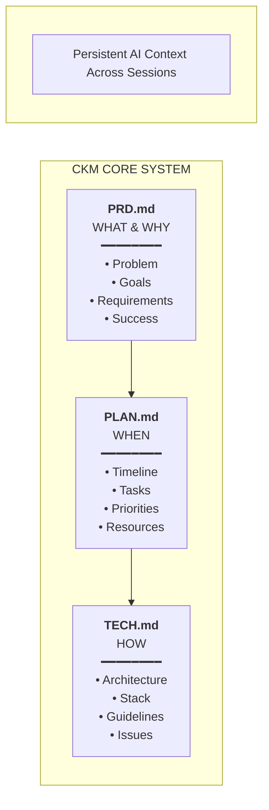

# Context Keeper Method (CKM) - Universal Documentation Framework for AI-Assisted Work

**Version:** 1.0
**Date:** September 2025
**Author:** Jerzy Mączewski
**Purpose:** Universal documentation framework for AI-assisted work across any domain - projects, change management, research, operations

---

## 📋 Executive Summary

This document defines the **Context Keeper Method (CKM)** - a universal **documentation framework for AI-assisted work** that separates objectives (WHAT), timeline planning (WHEN), and implementation approach (HOW). Applicable to product development, change management, research, operations, or any work requiring persistent AI context. Additional tool-specific documents like CLAUDE.md are added when using specific tools.

---

## 📌 Why "Context Keeper Method"?

When working with AI assistants (like Claude Code), the biggest challenge is **context loss between sessions**. You find yourself repeatedly explaining the same project details, requirements, and technical decisions to your AI collaborator.

CKM solves this by maintaining **strategic documentation** that:
- **Preserves project continuity** across AI sessions
- **Eliminates repetitive explanations** - AI can quickly understand project context
- **Evolves with your project needs** - documentation stays relevant
- **Currently uses 3 core documents**, but adapts as methodology evolves
- **Keeps context, kills chaos** - your AI never "forgets" what you're working on

**Core principle:** Document just enough to maintain context, nothing more. Be lazy, but smart about it.

---

## 🧠 Context Engineering Alignment

CKM implements **context engineering** principles - the systematic practice of structuring information to optimize AI collaboration. Unlike traditional prompt engineering (per-request optimization), CKM creates persistent context systems that serve as reliable AI memory across sessions, eliminating the need to repeatedly explain project details.

---

## 📚 The CKM Core System + Tool Extensions



### Core Philosophy
**Context Preservation + Enhanced Separation of Concerns** - CKM methodology consists of:

#### Core Documents (Required for all work):
- Stakeholders focus on **PRD** (what & why)
- Managers focus on **PLAN** (when & priorities)
- Implementers focus on **TECH** (how & execution)

#### Tool-Specific Extensions (Added when using specific tools):
- **CLAUDE.md** - When using Claude Code (AI assistant instructions)

#### Post-Completion Documentation:
- **README.md** - End-user documentation (created after project completion)

### Document Structure

#### 1️⃣ PRD.md - Project Requirements Document
**Purpose:** Define WHAT we're achieving and WHY

**Content:**
- **Problem Statement** - What problem or opportunity are we addressing?
- **Stakeholder Requirements** - Who are affected and what do they need?
- **Objectives** - Why is this important for the organization?
- **Functional Requirements** - What capabilities must be included?
- **Non-functional Requirements** - Performance, quality, compliance standards
- **Acceptance Criteria** - How do we know when it's complete?
- **Constraints & Assumptions** - Limitations and dependencies
- **Success Metrics** - How do we measure success?

**Format:** See [PRD-template.md](./templates/PRD-template.md) for complete structure and examples.

#### 2️⃣ PLAN.md - Implementation Plan & Timeline
**Purpose:** Define WHEN things will be done and in what order

**Content:**
- **Project Phases** - Major stages of development
- **Timeline** - Start/end dates, milestones
- **Task Breakdown** - Detailed task lists per phase
- **Priorities** - P0 (critical), P1 (important), P2 (nice-to-have)
- **Dependencies** - What needs to be done before what
- **Resource Allocation** - Who's doing what
- **Risk Management** - Potential issues and mitigation
- **Daily/Weekly Goals** - Specific deliverables

**Format:** See [PLAN-template.md](./templates/PLAN-template.md) for complete structure and examples.

#### 3️⃣ TECH.md - Technical & Implementation Document
**Purpose:** Define HOW we implement and execute the work

**Content:**
- **Architecture Overview** - System design and structure
- **Current Capabilities** - What's working now
- **Work in Progress** - What's being implemented
- **Known Issues** - Bugs and limitations
- **Technical Stack** - Languages, frameworks, tools
- **Code Organization** - Directory structure, modules
- **Development Guidelines** - Coding standards, patterns
- **Testing Strategy** - How to test the system
- **Deployment Process** - How to deploy/release
- **Performance Metrics** - System performance data
- **Security Considerations** - Security implementation details

**Format:** See [TECH-template.md](./templates/TECH-template.md) for complete structure and examples.

**Key TECH.md principles:**
- **For developers**: Main reference point for technical team
- **Currency**: Always reflects current system state
- **Specificity**: Real technologies, not abstractions
- **Solutions**: Describes how to solve known issues

#### 🤖 CLAUDE.md - AI Assistant Instructions (Claude Code Extension)
**Purpose:** Guide Claude Code's behavior with this repository
**Note:** This document is specific to Claude Code usage and is not part of the core CKM methodology

**Content:**
- **Project Overview** - Brief project context
- **Document References** - Links to PRD, PLAN, TECH files
- **Coding Standards** - Naming conventions, patterns
- **Tool Preferences** - Preferred commands and tools
- **Security Rules** - What never to commit or expose
- **Testing Commands** - How to run tests and checks
- **Git Workflow** - Branch strategy, commit guidelines
- **Common Tasks** - Frequently performed operations

**Note:** CLAUDE.md structure is defined by Claude Code documentation.

#### 📖 README.md - User Documentation (Post-Completion)
**Purpose:** End-user guide created AFTER project completion
**Note:** This is documentation for end users, not part of the core project methodology

**Content:**
- Installation instructions
- Usage examples
- API documentation
- Configuration options
- Troubleshooting guide

---

## 🎯 Separation of Concerns Guidelines

### Maintaining Clear Document Boundaries

One of the most critical aspects of CKM is maintaining strict separation between document purposes. Each document answers a single fundamental question and should not overlap with others.

### DO's and DON'Ts for Each Document

#### 📋 PRD.md - Business Focus (WHAT & WHY)

✅ **DO Include:**
- Business requirements and objectives
- Stakeholder needs and user stories
- Problem statements and context
- Success metrics and KPIs
- Constraints and assumptions
- Risk analysis from business perspective
- Acceptance criteria

❌ **DON'T Include:**
- Source code or code snippets
- File paths or line numbers
- Technical implementation details
- System architecture diagrams
- Deployment commands or procedures
- Timeline information (reference PLAN.md)

#### 📅 PLAN.md - Timeline Focus (WHEN)

✅ **DO Include:**
- Project phases and milestones
- Task breakdown and dependencies
- Resource allocation and responsibilities
- Risk mitigation timeline
- Priority levels (P0, P1, P2)
- Daily/weekly goals and deliverables
- Communication and stakeholder management

❌ **DON'T Include:**
- Technical architecture details
- Code examples or API specifications
- Business justifications (reference PRD.md)
- Temporary documentation as deliverables
- Implementation procedures (reference TECH.md)

#### 🔧 TECH.md - Implementation Focus (HOW)

✅ **DO Include:**
- System architecture and design
- Code organization and file structure
- API specifications and integrations
- Technical procedures and commands
- Performance metrics and benchmarks
- Known issues and solutions
- Development guidelines and patterns

❌ **DON'T Include:**
- Business rationale (reference PRD.md)
- Project timeline (reference PLAN.md)
- User requirements (reference PRD.md)
- Success metrics from business perspective
- Stakeholder communication plans

### Cross-Reference Strategy

**Instead of duplicating content:**
- ✅ "Implementation details in TECH.md Section 3.2"
- ✅ "Business rationale documented in PRD.md"
- ✅ "Timeline impact assessed in PLAN.md Phase 2"

**Avoid redundant explanations:**
- ❌ Copying the same technical details to multiple documents
- ❌ Re-explaining business justification in technical docs
- ❌ Duplicating timeline information across documents

### Common Pitfalls to Avoid

#### 1. **Temporary Documentation Mixing**
- **Issue:** Creating transitional docs (like MODIFICATIONS.md) and treating them as CKM deliverables
- **Solution:** Keep temporary docs separate, migrate content to appropriate CKM document, then delete

#### 2. **Boundary Blurring**
- **Issue:** Adding code snippets to PRD.md "for clarity"
- **Solution:** Reference TECH.md section instead, maintain strict boundaries

#### 3. **Content Duplication**
- **Issue:** Same information appearing in multiple documents
- **Solution:** Single source of truth principle - each piece of information lives in exactly one document

#### 4. **Scope Creep**
- **Issue:** Documents trying to be "complete" rather than focused
- **Solution:** Each document serves its specific audience with targeted information

### Pre-Finalization Checklist

Before finalizing your CKM documentation, verify:

#### Document Boundaries:
- [ ] No code snippets in PRD.md
- [ ] No architecture details in PLAN.md
- [ ] No business justifications in TECH.md
- [ ] No timeline information in PRD.md or TECH.md

#### Cross-References:
- [ ] All cross-references are accurate and specific
- [ ] No duplicated content between documents
- [ ] Each piece of information has single source of truth

#### Quality Checks:
- [ ] Each document answers its core question (WHAT/WHEN/HOW)
- [ ] Temporary documentation has been removed or migrated
- [ ] Document serves its intended audience effectively

**Remember:** Clean separation of concerns prevents documentation debt and ensures each document serves its specific purpose effectively.

---

## 🔄 Document Update Rules

### Update Workflows

#### 1. New Feature Addition
```
1. Update PRD.md with new requirement
2. Assess impact on PLAN.md timeline
3. Define technical approach in TECH.md
4. Update CLAUDE.md if workflow changes
5. Implement feature
6. Update status in TECH.md
7. Mark complete in PLAN.md
```

#### 2. Bug Found During Development
```
1. Add to Known Issues in TECH.md
2. Assess timeline impact for PLAN.md
3. Check if PRD.md requirements affected
4. Update CLAUDE.md if workflow affected
5. Fix bug
6. Update TECH.md status
7. Note resolution in all affected docs
```

#### 3. Timeline Adjustment
```
1. Update PLAN.md with new dates
2. Add note in TECH.md about schedule change
3. No PRD.md or CLAUDE.md change needed unless scope affected
```

#### 4. Technical Pivot
```
1. Document new approach in TECH.md
2. Assess timeline impact for PLAN.md
3. Verify PRD.md requirements still achievable
4. Update all affected sections
```

---

## 📁 Project Structure Guidelines

### Recommended Directory Layout
```
project-name/
├── PRD.md                 # Business requirements (CORE)
├── PLAN.md                # Timeline and tasks (CORE)
├── TECH.md                # Technical architecture (CORE)
├── CLAUDE.md              # AI assistant instructions (Claude Code only)
├── README.md              # User documentation (post-completion)
│
├── /src                   # Source code
├── /tests                 # Test files
├── /docs                  # Additional documentation
├── /configs               # Configuration files
└── /archives              # Old versions if needed
    ├── PRD_OLD.md
    ├── PLAN_OLD.md
    └── TECH_OLD.md
```

### Archival Strategy
- Keep old versions when major pivots occur
- Name format: `[DOCUMENT]_OLD_YYYY-MM-DD.md`
- Archive after significant restructuring
- Reference in new version if needed

---

## 🌐 Universal Application Examples

### Product Development
- **PRD.md**: User requirements, product features, business objectives
- **PLAN.md**: Development sprints, release timeline, feature priorities
- **TECH.md**: System architecture, technology stack, deployment process

### Change Management
- **PRD.md**: Current state analysis, desired outcomes, stakeholder impact
- **PLAN.md**: Change phases, communication timeline, training schedule
- **TECH.md**: Implementation methods, tools, rollback procedures

### Research Project
- **PRD.md**: Research questions, hypotheses, expected outcomes
- **PLAN.md**: Research phases, data collection timeline, milestones
- **TECH.md**: Methodology, tools, analysis procedures

### Operational Improvement
- **PRD.md**: Process problems, efficiency goals, stakeholder benefits
- **PLAN.md**: Implementation phases, training timeline, rollout plan
- **TECH.md**: New procedures, tools, measurement systems

---

## 🚀 Quick Start Template

When starting a new project:

### Core 3-Document Setup:
1. **Create PRD.md first**
   - Interview stakeholders
   - Define clear requirements
   - Set success metrics

2. **Develop PLAN.md based on PRD**
   - Break down into phases
   - Estimate timelines
   - Identify dependencies

3. **Create TECH.md**
   - Set up architecture
   - Define technical approach
   - Create development guidelines

### Tool-Specific Extensions:

4. **Setup CLAUDE.md (if using Claude Code)**
   - Configure AI assistant behavior
   - Set coding standards
   - Define workflow preferences

5. **During Development**
   - Keep TECH.md current
   - Update PLAN.md progress
   - Flag PRD.md changes immediately
   - Update CLAUDE.md only for workflow changes (if using Claude Code)

6. **After Completion**
   - Create README.md for end users
   - Archive old versions
   - Document lessons learned

---

## 📊 Success Indicators

Your CKM documentation is working well when:
- **AI sessions are seamless** - no repeated context explanations needed
- **New team members can onboard quickly** - clear project understanding from docs
- **Stakeholders know project status** without asking multiple times
- **Technical decisions have clear rationale** - documented for future reference
- **Timeline adjustments are predictable** - dependencies and constraints are clear
- **Requirements traceability is maintained** - business goals stay aligned with implementation
- **Context is never lost** - project continuity across all interactions

---

*This document defines the Context Keeper Method (CKM) - a modern approach to project documentation designed for the AI collaboration era. CKM ensures your AI assistant never loses project context, while maintaining just enough documentation to keep projects on track.*